<h1 align="center"> Anita Dataset</h1>
<h3 align="center">An Industrial Animation Dataset</h3>

---

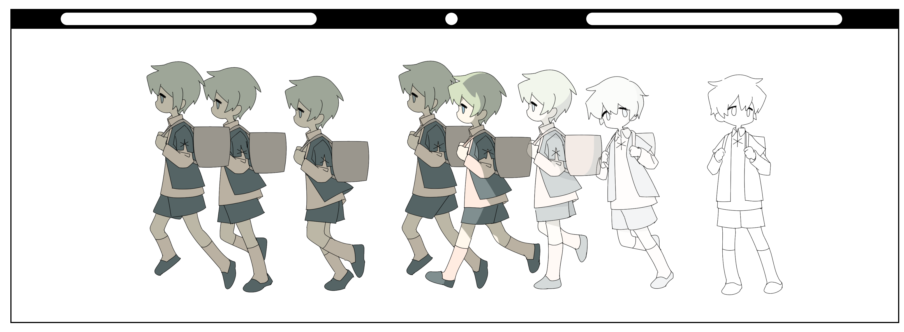

##  Introduction

This is the official repository for the Anita Dataset. 

Anita Dataset is a professional cartoon keyframe collection that provides high-quality hand-drawings from various animators. The dataset contains 17,000+ keyframe of itermidiate format used at standards of modern animation industry, including 1080P `sketches`, `color` images and `compositions`. 


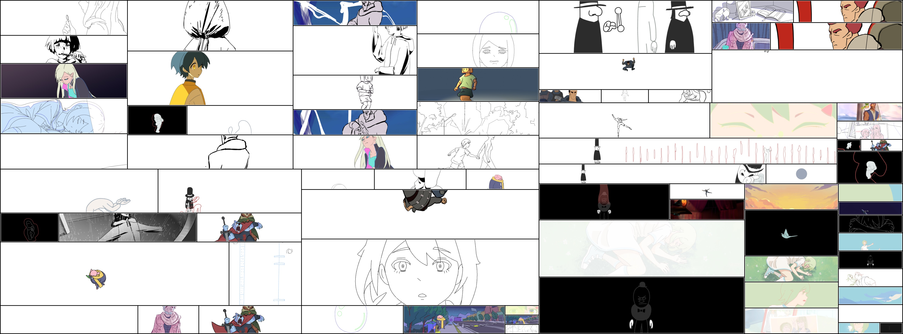

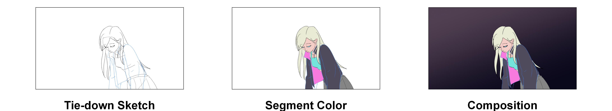
<div align="center">

<a href="https://youtu.be/k_nwXkyXaHc" align="center">Video Introduction</a>
</div>

Anita Dataset contains 17,000+ `.png` image sequence from 14 different cartoons, licensed by animators under [`CC BY-NC-SA 4.0`](https://creativecommons.org/licenses/by-nc-sa/4.0/deed.en) and [`CC BY`](https://creativecommons.org/licenses/by/4.0/deed.en) License. 

<div align="center">
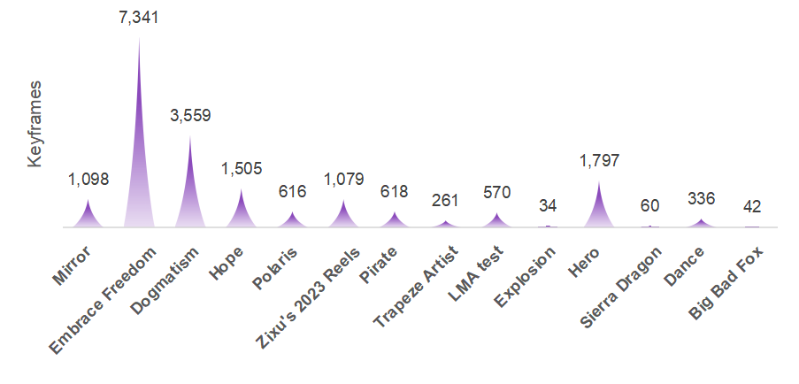
</div>

We design this dataset to facilitate cartoon research like inbetweening and colorization, researchers can use the dataset to train and evaluate their models.

For More Information, please refer to [Q&A](#qa) section.


##   Download

You can download the dataset from the [Google Drive link](https://drive.google.com/drive/folders/1J9J9Q6J9J9Q6J9Q6J9Q6J9Q6J9Q6J9Q6). The file size is  Feel free to download and explore it!

## Information

| Preview | Artist(A-Z)  | Animation         | Keyframe | Sketch Clip | Color Clip | Composition Clip | License |
|--------|--------------|-------------------|----------|-------------|------------|------------------|----|
| 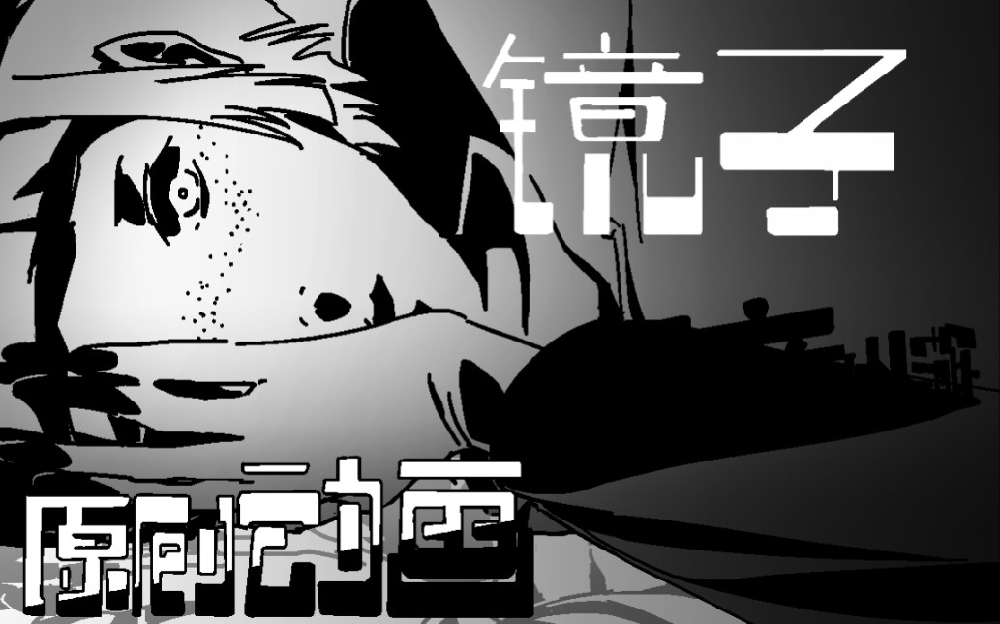       | [剑起长歌魂断蓝桥](https://space.bilibili.com/66637481) | [Mirror](https://www.bilibili.com/video/BV1fo4y1x7Kf)            | 1,098    | 15          | 15         | 0                | CC BY-NC-SA 4.0 |
| 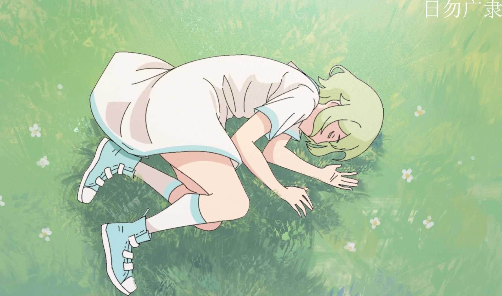       | [日勿广隶](https://space.bilibili.com/106188541)      | [Embrace Freedom](https://www.bilibili.com/video/BV15P41167Xr)   | 7,341    | 58          | 0          | 1                | CC BY-NC-SA 4.0|
|        | [_嘲讽怪_](https://space.bilibili.com/17377005)     | [Dogmatism](https://www.bilibili.com/video/BV1Ct4y1x7hd/)         | 3,559    | 12          | 7          | 0                | CC BY-NC-SA 4.0|
| 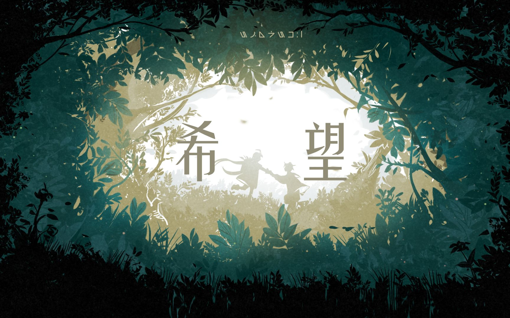       | [ONE_XT](https://space.bilibili.com/11558936)   | [Hope](https://www.bilibili.com/video/BV1XS4y187rP/)              | 1,505    | 69          | 63         | 0                | CC BY-NC-SA 4.0|
|        | [ONE_XT](https://space.bilibili.com/11558936)   | [Polaris](https://www.bilibili.com/video/BV1Ki4y1a79S/)           | 616      | 34          | 34         | 0                | CC BY-NC-SA 4.0|
| 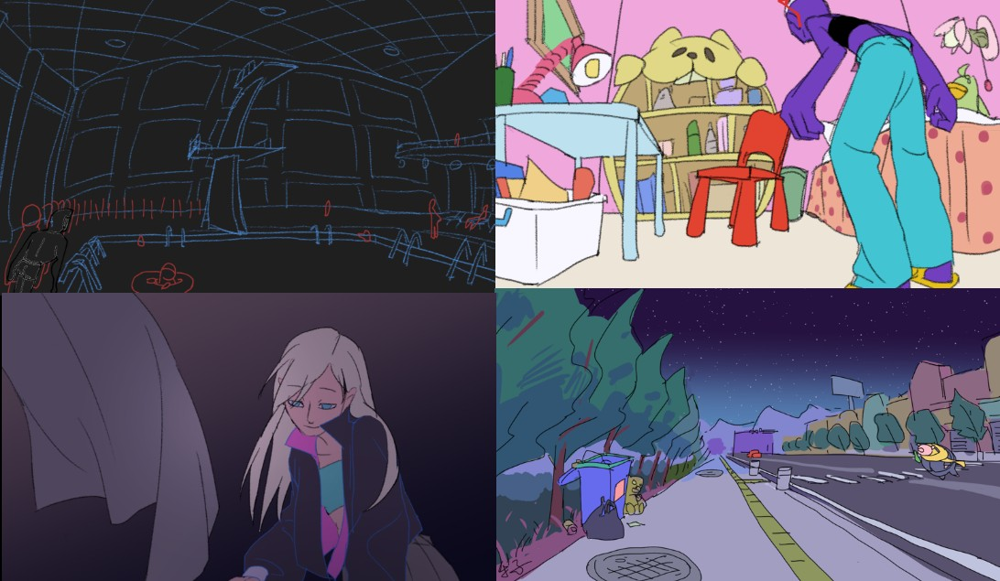       | [秄虚](https://space.bilibili.com/30760830)     | [Zixu's 2023 Reels](https://www.bilibili.com/video/BV1pu4y1M7vQ/) | 1,079    | 9           | 3          | 3                | CC BY-NC-SA 4.0|
|        | [Sergi Miranda](https://www.instagram.com/miranda.sergi/)     | [Pirate](http://www.sergimiranda.com/) | 618    |  1          |  1         |  1               | [CC BY](https://cloud.blender.org/p/gallery/5edd13a01e5ba50266481719) |
| 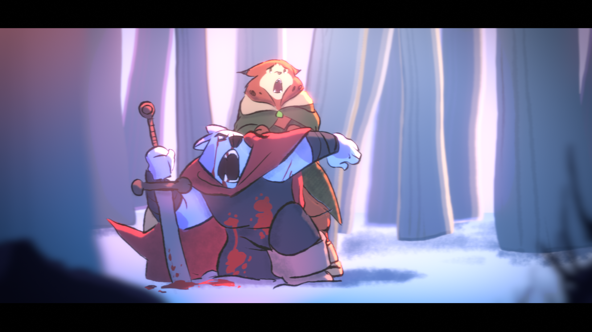       | [Renato Roldan](https://www.instagram.com/renato3xl/)     | [LMA test](https://vimeo.com/316551360) | 570    | 1           | 1          |  1               | [CC BY](https://cloud.blender.org/p/gallery/5cb45931808c0e42c75ba18d) |
| 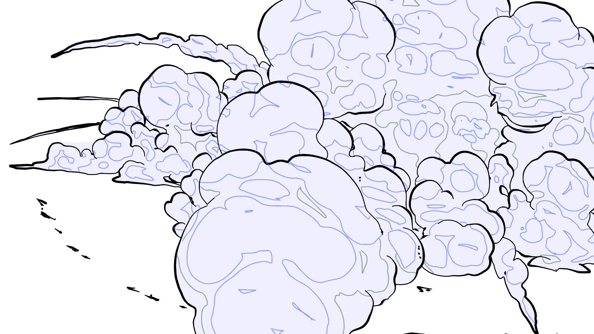       | [Nahu](https://x.com/Nahu_idi)     | [Explosion](https://cloud.blender.org/p/gallery/5daa438e07ad1b4dd6f36cd6) | 34    |   1         |   1        |   0              | [CC BY]((https://cloud.blender.org/p/gallery/5daa438e07ad1b4dd6f36cd6)) |
| 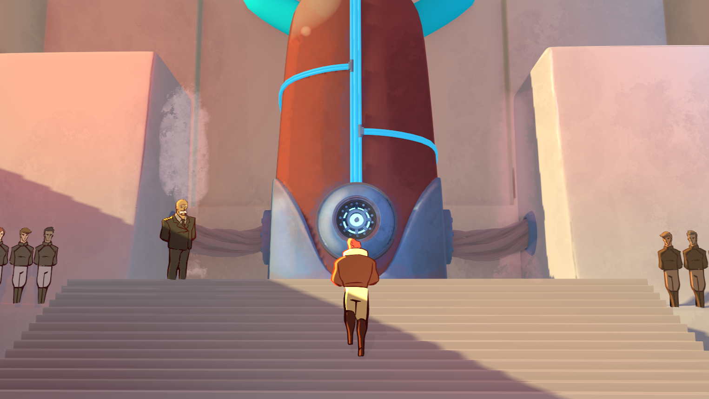       | [Daniel Martinez Lara ](http://pepeland.com/)    | [Hero](https://studio.blender.org/films/hero/) | 1,797    |  8          |   8        |   8              | [CC BY](https://cloud.blender.org/p/gallery/5b684e96bf419c4d7bd0ec26) |
| 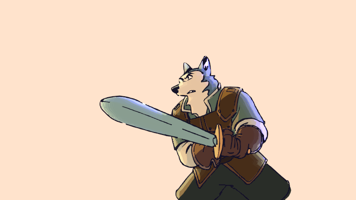       | [Pepe Sanchez](https://www.facebook.com/profile.php?id=100071832591529)     | [Sierra Dragon](https://www.facebook.com/watch/?v=601878917271995) | 60    | 1           |  1         |  1               | [CC BY](https://cloud.blender.org/p/gallery/612412fb92d84ca3d667c874) |
| 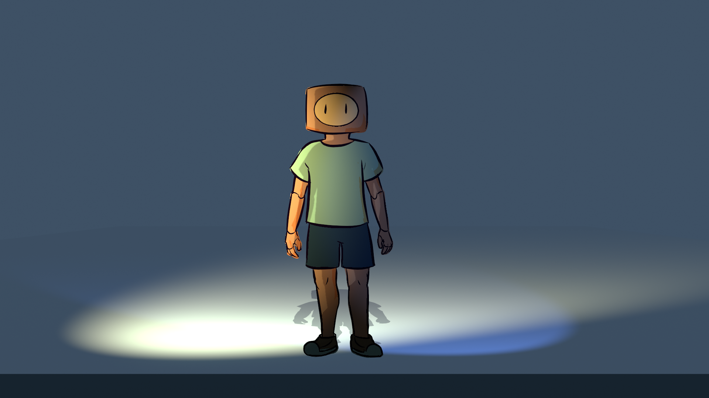       | [Lien-ze, Tsao](https://www.youtube.com/@LienzeTsao)     | [Dance](https://www.youtube.com/watch?v=WejpIdss__M&ab_channel=Lien-zeTsao) | 336    |  1          |  1         |  1               | [CC BY](https://cloud.blender.org/p/gallery/5bf6dfb05ae99900f6bb6cd7) |
| 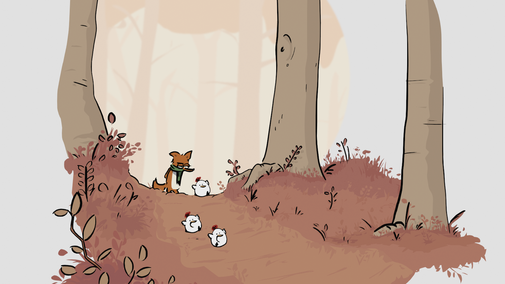       | [Christoph Lendenfeld](http://christoph.lendenfeld.at/)     | [Big Bad Fox](http://christoph.lendenfeld.at/inner_bigBadFox.html) | 42    |  1          |  1         |   1              | [CC BY](https://cloud.blender.org/p/gallery/5ec7937478de177e5e1e0247) |
| 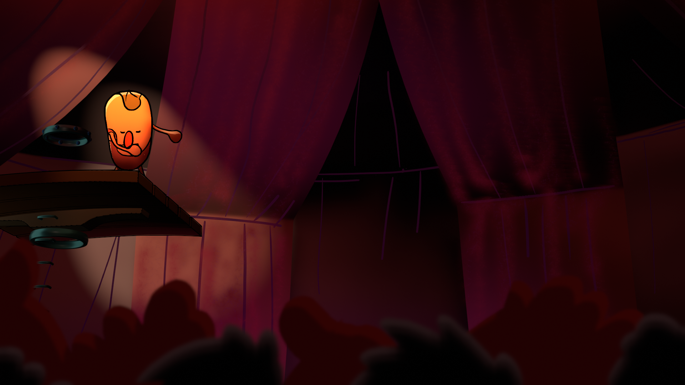       | [Jordi Porras](https://www.jordiporras.com/)     | [Trapeze Artist](https://www.jordiporras.com/#/portfolio-vfx/portfolio-vfx-13.html) |  261   |  1          |   1        |     1            | [CC BY](https://cloud.blender.org/p/gallery/5eacac7b0319e36ee5c1a5e6) |


##   File Structure

```bash
Anita_Dataset
├── Mirror
│   ├── scene_#
│   │   ├── sketch
│   │   │   ├── 0001.png
│   │   │   ├── 0002.png
│   │   │   ├── ...
│   │   ├── color
│   │   │   ├── 0001.png
│   │   │   ├── 0002.png
│   │   │   ├── ...
│   │   ├── composition
│   │   │   ├── 0001.png
│   │   │   ├── 0002.png
│   │   │   ├── ...
│   ├── scene_#
│   │   ├── ...
├── Embrace_Freedom
│   ├── scene_#
│   │   ├── sketch
│   │   │   ├── ...
```


##   Q&A

#### What is Anita Dataset different from other cartoon datasets?

- **Hand-drawn**: Unlike [AnimeRun](https://github.com/lisiyao21/AnimeRun) or [PBC](https://github.com/ykdai/BasicPBC), which are rendered from 3D character models, Anita Dataset consists of frames drawn by human hands, more aligned with the standards of modern 2D animation industry.

- **High-quality Intermediate Format**: Compared to [Sakuga-42M Dataset](https://drive.google.com/file/d/1aeJqsBw92ebELEpP-oFBo-kcUpBzHm_E/view) which provides large-scale but 480P, rendered clips, Anita Dataset provides high-resolution intermediate images, more than 17,000 sketch or flat color under 1080P resolution are provided.

- **Pairness** : Anita Dataset contains sketch-color pairs exported directly from engineering files.

#### Is the dataset licensed? 
- Yes. Anita Dataset is a licensed dataset. Animations are obtained with permission from the artists directly or with specific previous public license. 

#### Are there annotations provided ?
- No. If researchers need annotations, they can create their own annotations based on the dataset.

#### Is the sketch and color image paired?
- Some of them are paired, some of them are not. Researchers can pair them based on the folder name.

#### Will the dataset be updated?
- Yes. The dataset is an ongoing project and will be updated to include more available animations.

##  Citation
If you find this dataset useful, please consider citing our work:

```bibtex
@misc{WinNT,
  title = {Anita Dataset},
  howpublished = {https://github.com/zhenglinpan/AnitaDataset},
  note = {Accessed: 20124-06-24}
}
```