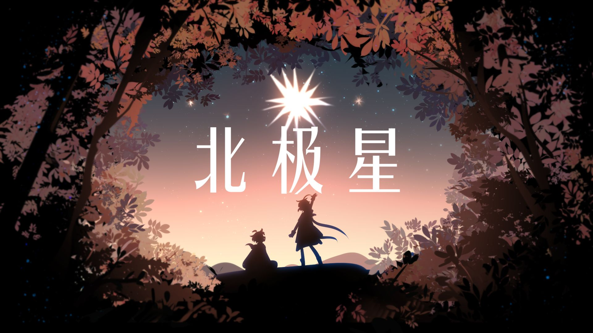
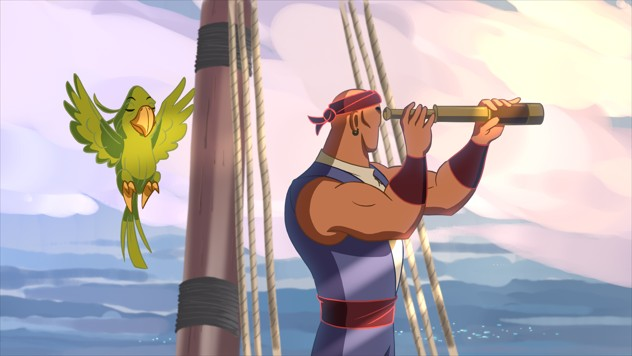

<h1 align="center"> Anita Dataset - An Industrial Animation Dataset</h1>

<div align="center">

[![Project Page](https://img.shields.io/badge/Project-Website-green?logo=data:image/png;base64,iVBORw0KGgoAAAANSUhEUgAAACAAAAAgCAYAAABzenr0AAAAAXNSR0IArs4c6QAAAARnQU1BAACxjwv8YQUAAAAJcEhZcwAALiMAAC4jAXilP3YAAALvSURBVFhHxZdL6E1BHMev9/sZFqIQIbLwimQrskBK2Yk8UigWCAuPQlEWYofIa8VSRPJOkiQ7b0qIhffb5zv3/K75j5l7zv3r8KlP58zMuef8zpyZ38xtVUlzBNvgHVf6x4zGnzjDlf4D2/EJtnClEmmZHUNG4lVUL5RKKgB9+y/V03JJBXAXJ2GqvRT0ve2bj8LvuNaVSsQfZJ1xK67AH7geN+Fe3IJvsAN2wa7YLTt2z86t3m+zc6l778ckCkAP3oeWHxbia1RvfEMNyuaql6mLBaCLlYRao9CbPcDwho16EOviByBPYjvsjeoB1akXVuLAgh5Fu995rEsYgDyF84M6BbEMi7AU7Xf3VFGPWAByD74N6uQOzJumY9Gu/4h1M2ssAHV9X5yImgV+mzyG7TGF2j6jXd8Hk8QCuI2GFqiX6LfLC9gTU1xHu3aMKnzyulBjwLiJU1Bv5DMZL+EAV/qTG9lR9M+ONfICOJMd2+ISPIGaGSHD8Qqql0L8APplxyjhJ3iHygGL8VFWl6cG61T00cpq7cqoScIA9G0VvZWL+hUXoKGV9T2q7ZAqUoQBaE3QqPWTSSNuRJt2F1F1eqkkYQDD0JiGD9HainoA1QO7svJ9TOIHoIeFdMKd2OiidBo1gHX+AZPJyA9AS7CYjZuxlytVuYX+A4r43DtPJiM/AD14iFf21/FPaDdrjuOwRiwPqIvPoqah8rd4lR2FpuTfkMwF1gOXXamKEswstL2BWIWxNyvqcoxiAaxzpTTaLWnX5N9Uv9uN+j+h3bTfFroNo1gA410pnwm4Blejv8iMwHMYe7g8jFEUwAv0/y9qjEyvnkbRcqupOdiVfqOpNhefYhiAklIUBaCs5zMT9SPt54aiDVo9WG3646rVcQ7G0D3V5RrMFkAsxzh08bzqaRMWoW1GdHyMNhWvoXY9eQzC46hPrGRU62U/K3XEHvjMlZqi4LTKaVbov4E2Jsrr2iMokKJorGxAvRSfu1L5BV6BYxc58SI5AAAAAElFTkSuQmCC)](https://zhenglinpan.github.io/Sakuga_42M/)
[](https://creativecommons.org/licenses/by-nc-sa/4.0/)
[](https://creativecommons.org/licenses/by/4.0/deed.en)

<a href="https://zhenglinpan.github.io/homepage/">Zhenglin Pan</a>,
<a href="https://github.com/UNKNOWNTIMER">Yu Zhu</a>

</div>

---


##  Introduction

This is the official repository for the Anita Dataset. 

[Video Introduction](https://youtu.be/k_nwXkyXaHc)

Anita Dataset is a collection of 16,000+ professional hand-drawn cartoon keyframes. The dataset contains 1080P `sketch`, `color` images and `composition` exported from engineering files of 14 different animations(more than 200 scenes in total), following the professional standards of the modern 2D animation industry.

<table class="center">
<tr>
    <td width=33.3% style="border: none"></td>
    <td width=33.3% style="border: none"></td>
    <td width=33.3% style="border: none"></td>
</tr>
<tr style="text-align: center;">
    <td width=33.3% style="border: none">Sketch</td>
    <td width=33.3% style="border: none">Color</td>
    <td width=33.3% style="border: none">Composition</td>
</tr>
</table>

Cartoon image sequence are provided in `.png` format, licensed by animators under [`CC BY-NC-SA 4.0`](https://creativecommons.org/licenses/by-nc-sa/4.0/deed.en) and [`CC BY`](https://creativecommons.org/licenses/by/4.0/deed.en) License. Here we show some examples of the dataset:

<table class="center">
<tr>
    <td width=33.3% style="border: none"></td>
    <td width=33.3% style="border: none"></td>
</tr>
<tr style="text-align: center;">
    <td width=33.3% style="border: none">Example 1 - Sketch</td>
    <td width=33.3% style="border: none">Example 1 - Color</td>
</tr>
</table>

<table class="center">
<tr>
    <td width=33.3% style="border: none"></td>
    <td width=33.3% style="border: none"></td>
</tr>
<tr style="text-align: center;">
    <td width=33.3% style="border: none">Example 2 - Sketch</td>
    <td width=33.3% style="border: none">Example 2 - Composition</td>
</tr>
</table>

<table class="center">
<tr>
    <td width=33.3% style="border: none"></td>
    <td width=33.3% style="border: none"></td>
</tr>
<tr style="text-align: center;">
    <td width=33.3% style="border: none">Example 3 - Sketch</td>
    <td width=33.3% style="border: none">Example 3 - Color</td>
</tr>
</table>

<table class="center">
<tr>
    <td width=33.3% style="border: none"></td>
    <td width=33.3% style="border: none"></td>
</tr>
<tr style="text-align: center;">
    <td width=33.3% style="border: none">Example 4 - Sketch</td>
    <td width=33.3% style="border: none">Example 4 - Composition</td>
</tr>
</table>

<div align="center">

</div>

We designed this dataset to facilitate cartoon research, such as inbetweening and colorization. Researchers can use the dataset to train and evaluate their models.

For more Information, please refer to [Q&A](#qa) section.


##   Download

We provide two download links for the Anita Dataset:

[Google Drive](https://drive.google.com/file/d/1ctfD0sMpT2pVutJUOlyEYKhAxufMYmZ_/view?usp=sharing)

[百度网盘](https://pan.baidu.com/s/1uo9W4sO9oAlnlxp9h4fw-A?pwd=anit)

The file size of current Anita Dataset is `7.14G`, feel free to download and explore it!

## Information
| Preview                                | Animation                                                                           | Artist(A-Z)                                                             | Keyframe | Sketch Clip | Color Clip | Composition Clip | License                                                               |
|----------------------------------------|-------------------------------------------------------------------------------------|-------------------------------------------------------------------------|----------|-------------|------------|------------------|-----------------------------------------------------------------------|
|        | [Dogmatism](https://www.bilibili.com/video/BV1Ct4y1x7hd/)                           | [\_嘲讽怪\_](https://space.bilibili.com/17377005)                       | 3,559    | 12          | 7          | 0                | CC BY-NC-SA 4.0                                                       |
|           | [Mirror](https://www.bilibili.com/video/BV1fo4y1x7Kf)                               | [剑起长歌魂断蓝桥](https://space.bilibili.com/66637481)                 | 1,098    | 15          | 15         | 0                | CC BY-NC-SA 4.0                                                       |
|  | [Embrace Freedom](https://www.bilibili.com/video/BV15P41167Xr)                      | [日勿广隶](https://space.bilibili.com/106188541)                        | 5,338    | 58          | 0          | 1                | CC BY-NC-SA 4.0                                                       |
|    | [Zixu's 2023 Reels](https://www.bilibili.com/video/BV1pu4y1M7vQ/)                   | [秄虚](https://space.bilibili.com/30760830)                             | 1,079    | 9           | 3          | 3                | CC BY-NC-SA 4.0                                                       |
|      | [Big Bad Fox](http://christoph.lendenfeld.at/inner_bigBadFox.html)                  | [Christoph Lendenfeld](http://christoph.lendenfeld.at/)                 | 42       | 1           | 1          | 1                | [CC BY](https://cloud.blender.org/p/gallery/5ec7937478de177e5e1e0247) |
|             | [Hero](https://studio.blender.org/films/hero/)                                      | [Daniel Martinez Lara ](http://pepeland.com/)                           | 1,797    | 8           | 8          | 8                | [CC BY](https://cloud.blender.org/p/gallery/5b684e96bf419c4d7bd0ec26) |
|   | [Trapeze Artist](https://www.jordiporras.com/#/portfolio-vfx/portfolio-vfx-13.html) | [Jordi Porras](https://www.jordiporras.com/)                            | 261      | 1           | 1          | 1                | [CC BY](https://cloud.blender.org/p/gallery/5eacac7b0319e36ee5c1a5e6) |
|            | [Dance](https://www.youtube.com/watch?v=WejpIdss__M&ab_channel=Lien-zeTsao)         | [Lien-ze, Tsao](https://www.youtube.com/@LienzeTsao)                    | 336      | 1           | 1          | 1                | [CC BY](https://cloud.blender.org/p/gallery/5bf6dfb05ae99900f6bb6cd7) |
|        | [Explosion](https://cloud.blender.org/p/gallery/5daa438e07ad1b4dd6f36cd6)           | [Nahu](https://x.com/Nahu_idi)                                          | 34       | 1           | 1          | 0                | [CC BY](https://cloud.blender.org/p/gallery/5daa438e07ad1b4dd6f36cd6) |
|             | [Hope](https://www.bilibili.com/video/BV1XS4y187rP/)                                | [ONE_XT](https://space.bilibili.com/11558936)                           | 1,478    | 69          | 63         | 0                | CC BY-NC-SA 4.0                                                       |
|          | [Polaris](https://www.bilibili.com/video/BV1Ki4y1a79S/)                             | [ONE_XT](https://space.bilibili.com/11558936)                           | 586      | 34          | 34         | 0                | CC BY-NC-SA 4.0                                                       |
|    | [Sierra Dragon](https://www.facebook.com/watch/?v=601878917271995)                  | [Pepe Sanchez](https://www.facebook.com/profile.php?id=100071832591529) | 60       | 1           | 1          | 1                | [CC BY](https://cloud.blender.org/p/gallery/612412fb92d84ca3d667c874) |
|         | [LMA test](https://vimeo.com/316551360)                                             | [Renato Roldan](https://www.instagram.com/renato3xl/)                   | 570      | 1           | 1          | 1                | [CC BY](https://cloud.blender.org/p/gallery/5cb45931808c0e42c75ba18d) |
|           | [Pirate](http://www.sergimiranda.com/)                                              | [Sergi Miranda](https://www.instagram.com/miranda.sergi/)               | 618      | 1           | 1          | 1                | [CC BY](https://cloud.blender.org/p/gallery/5edd13a01e5ba50266481719) |

##   File Structure

```bash
Anita_Dataset
├── Mirror
│   ├── scene_#
│   │   ├── sketch
│   │   │   ├── 0001.png
│   │   │   ├── 0002.png
│   │   │   ├── ...
│   │   ├── color
│   │   │   ├── 0001.png
│   │   │   ├── 0002.png
│   │   │   ├── ...
│   │   ├── composition
│   │   │   ├── 0001.png
│   │   │   ├── 0002.png
│   │   │   ├── ...
│   ├── scene_#
│   │   ├── ...
├── Embrace_Freedom
│   ├── scene_#
│   │   ├── sketch
│   │   │   ├── ...
```


##   Q&A

#### What is Anita Dataset different from other cartoon datasets?

- **Hand-drawn Authenticity**: Unlike [AnimeRun](https://github.com/lisiyao21/AnimeRun) or [PBC](https://github.com/ykdai/BasicPBC), which are rendered from 3D character models, Anita Dataset consists of frames drawn by human hands, aligning more closely with the standards of the modern 2D animation industry.

- **High-quality Intermediate Format**: Compared to [Sakuga-42M Dataset](https://drive.google.com/file/d/1aeJqsBw92ebELEpP-oFBo-kcUpBzHm_E/view), which provides large-scale but 480p rendered clips, Anita Dataset offers high-resolution intermediate images. More than 16,000 sketches and flat colors are provided in 1080p resolution.

- **Sketch-Color Alignment** : Anita Dataset contains sketch-color pairs exported directly from engineering files.

#### Is the dataset licensed? 
- Yes. Anita Dataset is a licensed dataset. Animations are obtained with permission from the artists directly or with a specific previous public license.

#### Are there annotations provided ?
- No. If researchers need annotations, they can create their own based on the dataset.

#### Is the sketch and color image paired?
- Some of them are paired, and some are not. Researchers can pair them based on the folder name.

#### Will the dataset be updated?
- Yes. The dataset is an ongoing project and will be updated to include more available animations.

##  Citation
If you find this dataset useful, please consider citing our work:

```bibtex
@misc{Anita2024,
  title = {Anita Dataset},
  howpublished = {https://zhenglinpan.github.io/AnitaDataset_homepage/},
  note = {Accessed: 2024-06-25}
}
```
